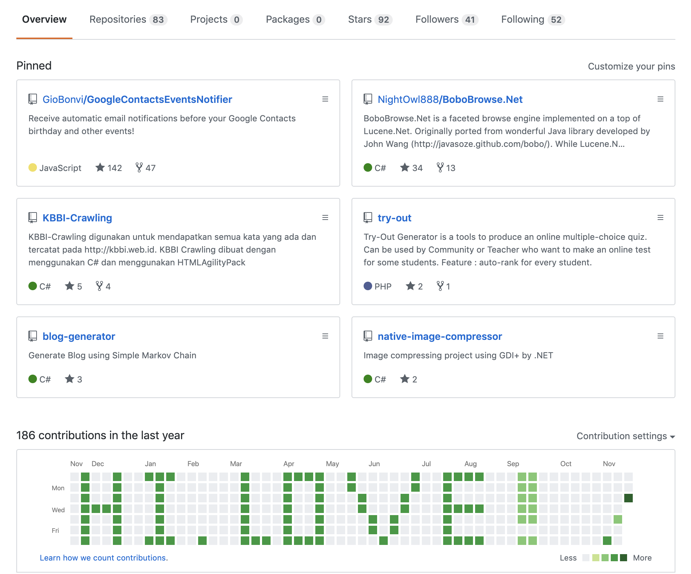

# Github Contrib Write

Do you want to write something in your github contribution panel?

Now, you can write it with this cli.



## Build
```bash
go get -u github.com/muzavan/github-contrib-write
cd $GOPATH/src/github.com/muzavan/github-contrib-write
go build main.go
```

## Usage
```bash
./main -h
Usage of ./main:
  -date string
        Current date in yyyy-mm-dd format using now as default
  -email string
        Email of the committer (default "genbot@genbot.com")
  -folder string
        Folder where generated file/commits stored (default "./gen")
  -name string
        Name of the committer (default "Gen Bot")
  -textFile string
        Path to file with 1s to define your github contrib panel style (default "file.txt")
```

## Notes
The example of the generated content can be checked out [here](github.com/muzavan/github-contrib-write-gen).

Feedback and pull requests are much appreciated!
